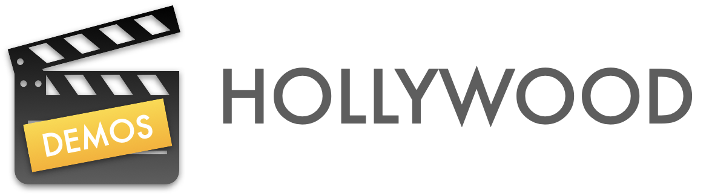

# Hollywood Demos

The Hollywood Demos repo contains several demo apps showcasing how to build and integrate asynchronous app workflows
using the [Hollywood](https://github.com/briancoyner/hollywood) libraries.  

## Demos
There are 3 demos available (more coming soon):

### GitHub OAuth demo
- [X] Shows how to build an async workflow that authenticates with GitHub. 
  - You'll need to update the `HackGitHubApp` with your GitHub client ID and GitHub client secret. 
    - https://docs.github.com/en/developers/apps/building-github-apps/creating-a-github-app 
  
### iTunes Music Search
- [X] Shows how to build an async workflow that:
  - Uses a `ContextualActor` + `AsyncWorkflowAction` to execute an async HTTP request using `URLSession`.
  - Presents the search results in a SwiftUI list view.
  - There's also an example showing how to debounce the search text input. 

- [X] Shows how to use a `ContextualActor` to asynchronously load album art for each search result.
  - Similar to the `AsyncImage` API
  
### Progress Reporting
- [X] Shows how to build asynchronous workflows that generate progress using `Foundation/Progress`.
  - Demonstrates using the `Hollywood/ProgressReportingWorkflowAction`.

## Requirements
- Xcode 16/ Swift 6
- iOS 17+
- macOS 14+

## Credits

Hollywood Demos is written and maintained by [Brian Coyner](https://briancoyner.github.io).

## License

Hollywood Demos is released under the MIT License.
See [LICENSE](https://github.com/briancoyner/hollywood-demos/blob/master/LICENSE) for details.
